```mermaid
sequenceDiagram
    participant Client
    participant Server
    
    Note right of Client: ⚡ All connections close after response
    
    Note over Client,Server: 1. Initialize
    Client->>+Server: POST /mcp<br/>initialize request
    Server-->>-Client: 200 OK (text/event-stream)<br/>initialize response via SSE
    Note right of Server: Connection closed
    
    Note over Client,Server: 2. Initialized Notification
    Client->>+Server: POST /mcp<br/>initialized notification
    Server-->>-Client: 202 Accepted
    Note right of Server: Connection closed
    
    Note over Client,Server: 3. List Tools
    Client->>+Server: POST /mcp<br/>tools/list request
    Server-->>-Client: 200 OK (text/event-stream)<br/>tools list via SSE
    Note right of Server: Connection closed
    
    Note over Client,Server: 4. Call Tool
    Client->>+Server: POST /mcp<br/>tools/call request
    Server-->>-Client: 200 OK (text/event-stream)<br/>tool result via SSE
    Note right of Server: Connection closed
```

```mermaid
sequenceDiagram
    participant Client
    participant Server
    
    Note over Client,Server: 1. Establish SSE Connection
    Client->>+Server: GET /sse
    Server-->>Client: 200 OK (text/event-stream)
    rect rgba(128, 128, 128, 0.1) 
        Note right of Server: 🔄 Long-lived connection<br/>stays open for SSE events
        Server-->>Client: SSE: endpoint URL with session_id
        
        Note over Client,Server: 2. Initialize
        Client->>Server: POST /messages/?session_id=xxx<br/>initialize request
        Client-->>Client: 202 Accepted
        Server-->>Client: SSE: initialize response
        
        Note over Client,Server: 3. Initialized Notification
        Client->>Server: POST /messages/?session_id=xxx<br/>initialized notification
        Client-->>Client: 202 Accepted
        
        Note over Client,Server: 4. List Tools
        Client->>Server: POST /messages/?session_id=xxx<br/>tools/list request
        Client-->>Client: 202 Accepted
        Server-->>Client: SSE: tools list response
        
        Note over Client,Server: 5. Call Tool
        Client->>Server: POST /messages/?session_id=xxx<br/>tools/call request
        Client-->>Client: 202 Accepted
        Server-->>Client: SSE: tool result
    end
    Server-->>-Client: Connection closes
```

# MCP Transport Protocol Comparison

This repo compares the HTTP messages (headers and body) across three MCP transport configurations:
1. HTTP Streamable - Stateless
2. HTTP Streamable - Stateful
3. SSE (Server-Sent Events)

## Table of Contents
- [Overview](#overview)
- [Quick Comparison](#quick-comparison)
- [Key Differences Summary](#key-differences-summary)
- [1. HTTP Streamable - Stateless](#1-http-streamable---stateless)
- [2. HTTP Streamable - Stateful](#2-http-streamable---stateful)
- [3. SSE Transport](#3-sse-transport)

---

## Overview

All three configurations use the FastMCP framework (v2.14.0) with the MCP protocol version `2025-11-25`. The server provides a simple `greet` tool, and the client performs the following operations:
1. Initialize connection
2. List available tools
3. Call the `greet` tool with parameter `name='Teddy 🐶'`

---

## Quick Comparison

| Feature | SSE | HTTP Streamable (Stateless) | HTTP Streamable (Stateful) |
|---------|-----|----------------------------|---------------------------|
| **Endpoint** | `/sse` | `/mcp` | `/mcp` |
| **Session Management** | Query parameter | None | Header (`mcp-session-id`) |
| **Long-lived Connection** | ✓ (GET /sse) | ✗ | ✓ (GET /mcp) |
| **Initial Request** | GET | POST | POST |
| **Message Endpoint** | `/messages/?session_id=...` | Same (`/mcp`) | Same (`/mcp`) |
| **Session Cleanup** | Implicit | N/A | Explicit (DELETE) |
| **Total HTTP Requests** | 5 (1 GET + 4 POST) | 4 (4 POST) | 6 (1 POST + 1 GET + 3 POST + 1 DELETE) |
| **Response Status Codes** | 202 for POSTs | 200/202 | 200/202 |
| **Response Content Type** | `text/event-stream; charset=utf-8` | `text/event-stream` | `text/event-stream` |
| **Cache Control** | `no-store` | `no-cache, no-transform` | `no-cache, no-transform` |
| **Sampling** | ✓ | ✗ | ✓ |
| **Elicitation** | ✓ | ✗ | ✓ |
| **Progress Notifications** | ✓ | ✗ | ✓ |
| **Logging** | ✓ | ✗ | ✓ |
| **Roots Listing** | ✓ | ✗ | ✓ |
| **Change Notifications** | ✓ | ✗ | ✓ |
| **Background Tasks** | ✓ | ✗ | ✓ |
| **Best For** | Traditional SSE pattern | Microservices, serverless | Long-lived sessions |
| **Scalability** | Good | Excellent | Good |
| **Complexity** | Medium | Low | High |

---

## Key Differences Summary

### 1. Connection Pattern

| Feature | SSE | HTTP Stateless | HTTP Stateful |
|---------|-----|----------------|---------------|
| **Initial Connection** | GET /sse | POST /mcp | POST /mcp |
| **Endpoint Discovery** | Via SSE event | Direct to /mcp | Direct to /mcp |
| **Message Endpoint** | /messages/?session_id=... | /mcp | /mcp |
| **Session Management** | Query parameter | None | mcp-session-id header |
| **GET Stream** | ✓ (initial) | ✗ | ✓ (persistent) |
| **Session Cleanup** | Implicit | N/A | DELETE /mcp |

### 2. HTTP Methods Usage

| Transport | GET | POST | DELETE |
|-----------|-----|------|--------|
| **SSE** | 1x (initial SSE) | 4x (all messages) | 0 |
| **HTTP Stateless** | 0 | 4x (all operations) | 0 |
| **HTTP Stateful** | 1x (SSE stream) | 4x (messages) | 1x (cleanup) |

### 3. Header Differences

#### SSE Transport
- **Unique Headers**: `content-type: text/event-stream; charset=utf-8`, `cache-control: no-store`
- **Session ID**: In query parameter (`?session_id=...`)
- **Response Status**: 202 Accepted for all POST requests

#### HTTP Streamable - Stateless
- **Unique Headers**: `content-type: text/event-stream` (without charset), `cache-control: no-cache, no-transform`
- **Session ID**: None (stateless)
- **Response Status**: 200 OK for requests, 202 Accepted for notifications
- **Content-Type**: `application/json` for 202 responses, `text/event-stream` for 200 responses

#### HTTP Streamable - Stateful
- **Unique Headers**: `mcp-session-id` header present in all requests/responses after initialization
- **Session ID**: In header (`mcp-session-id: ...`)
- **Response Status**: Same as stateless (200 OK for requests, 202 Accepted for notifications)
- **Additional Request**: GET /mcp for persistent SSE stream
- **Cleanup**: DELETE /mcp to terminate session

### 4. Response Patterns

| Operation | SSE | HTTP Stateless | HTTP Stateful |
|-----------|-----|----------------|---------------|
| **Initialize** | 202 → SSE message | 200 + SSE stream | 200 + SSE stream + session ID |
| **Notification** | 202 | 202 | 202 |
| **Request** | 202 → SSE message | 200 + SSE stream | 200 + SSE stream |
| **Stream** | Initial GET only | Per-request stream | Persistent GET stream |

### 5. State Management

- **SSE**: Session ID in URL query parameter, separate endpoint for messages
- **Stateless HTTP**: No session management, each request is independent
- **Stateful HTTP**: Session ID in header, persistent connection via GET, explicit cleanup

### 6. Connection Efficiency

- **SSE**: 1 persistent GET + 4 POST requests = **5 HTTP requests**
- **HTTP Stateless**: 4 POST requests = **4 HTTP requests**
- **HTTP Stateful**: 1 POST + 1 GET (persistent) + 3 POST + 1 DELETE = **6 HTTP requests**

### 7. Capabilities Differences

The **SSE transport** returns more extensive capabilities in the initialize response:

```json
{
  "experimental": {
    "tasks": {
      "list": {},
      "cancel": {},
      "requests": {
        "tools": {"call": {}},
        "prompts": {"get": {}},
        "resources": {"read": {}}
      }
    }
  }
}
```

While **HTTP Streamable** (both modes) returns minimal capabilities:
```json
{
  "experimental": {}
}
```

### 8. Use Case Recommendations

| Transport | Best For | Considerations |
|-----------|----------|----------------|
| **SSE** | Traditional browser-based applications | Separate GET for events, POST for commands; well-established pattern |
| **HTTP Stateless** | Microservices, serverless, load-balanced | Simplest, most scalable; no state to manage |
| **HTTP Stateful** | Long-lived connections, complex interactions | Most efficient for persistent sessions; requires session cleanup |

---

---

## 1. HTTP Streamable - Stateless

### Server Configuration
- **Mode**: Stateless
- **Transport**: HTTP Streamable
- **Endpoint**: `http://127.0.0.1:8000/mcp`

### Sequence Diagram



### HTTP Messages

#### 2.1 Initialize Request (POST)
**Client Request:**
```http
POST /mcp HTTP/1.1
Host: localhost:8000
Content-Type: application/json

{
  "jsonrpc": "2.0",
  "id": 0,
  "method": "initialize",
  "params": {
    "protocolVersion": "2025-11-25",
    "capabilities": {
      "experimental": {
        "tasks": {}
      }
    },
    "clientInfo": {
      "name": "mcp",
      "version": "0.1.0"
    }
  }
}
```

**Server Response:**
```http
HTTP/1.1 200 OK
date: Fri, 12 Dec 2025 13:41:31 GMT
server: uvicorn
cache-control: no-cache, no-transform
connection: keep-alive
content-type: text/event-stream
x-accel-buffering: no
transfer-encoding: chunked
```

**SSE Message:**
```json
{
  "jsonrpc": "2.0",
  "id": 0,
  "result": {
    "protocolVersion": "2025-11-25",
    "capabilities": {
      "experimental": {},
      "prompts": {"listChanged": true},
      "resources": {"subscribe": false, "listChanged": true},
      "tools": {"listChanged": true}
    },
    "serverInfo": {
      "name": "My MCP Server",
      "version": "2.14.0"
    }
  }
}
```

#### 2.2 Initialized Notification (POST)
**Client Request:**
```http
POST /mcp HTTP/1.1
Host: localhost:8000
Content-Type: application/json

{
  "jsonrpc": "2.0",
  "method": "notifications/initialized",
  "params": null
}
```

**Server Response:**
```http
HTTP/1.1 202 Accepted
date: Fri, 12 Dec 2025 13:41:31 GMT
server: uvicorn
content-type: application/json
content-length: 0
```

#### 2.3 List Tools Request (POST)
**Client Request:**
```http
POST /mcp HTTP/1.1
Host: localhost:8000
Content-Type: application/json

{
  "jsonrpc": "2.0",
  "id": 1,
  "method": "tools/list",
  "params": null
}
```

**Server Response:**
```http
HTTP/1.1 200 OK
date: Fri, 12 Dec 2025 13:41:31 GMT
server: uvicorn
cache-control: no-cache, no-transform
connection: keep-alive
content-type: text/event-stream
x-accel-buffering: no
transfer-encoding: chunked
```

**SSE Message:**
```json
{
  "jsonrpc": "2.0",
  "id": 1,
  "result": {
    "tools": [
      {
        "name": "greet",
        "description": "Greets a person by name with a friendly hello message.\n\nArgs:\n    name: The name of the person to greet\n\nReturns:\n    A personalized greeting message",
        "inputSchema": {
          "properties": {"name": {"type": "string"}},
          "required": ["name"],
          "type": "object"
        },
        "outputSchema": {
          "properties": {"result": {"type": "string"}},
          "required": ["result"],
          "type": "object",
          "x-fastmcp-wrap-result": true
        },
        "_meta": {"_fastmcp": {"tags": []}}
      }
    ]
  }
}
```

#### 2.4 Call Tool Request (POST)
**Client Request:**
```http
POST /mcp HTTP/1.1
Host: localhost:8000
Content-Type: application/json

{
  "jsonrpc": "2.0",
  "id": 2,
  "method": "tools/call",
  "params": {
    "name": "greet",
    "arguments": {"name": "Teddy 🐶"},
    "_meta": {"progressToken": 2}
  }
}
```

**Server Response:**
```http
HTTP/1.1 200 OK
date: Fri, 12 Dec 2025 13:41:31 GMT
server: uvicorn
cache-control: no-cache, no-transform
connection: keep-alive
content-type: text/event-stream
x-accel-buffering: no
transfer-encoding: chunked
```

**SSE Message:**
```json
{
  "jsonrpc": "2.0",
  "id": 2,
  "result": {
    "content": [
      {
        "type": "text",
        "text": "Hello, Teddy 🐶 from MCP server!"
      }
    ],
    "structuredContent": {
      "result": "Hello, Teddy 🐶 from MCP server!"
    },
    "isError": false
  }
}
```

### Server Logs
```
INFO:     127.0.0.1:36210 - "POST /mcp HTTP/1.1" 200 OK
INFO:     127.0.0.1:36224 - "POST /mcp HTTP/1.1" 202 Accepted
INFO:     127.0.0.1:36226 - "POST /mcp HTTP/1.1" 200 OK
INFO:     127.0.0.1:36232 - "POST /mcp HTTP/1.1" 200 OK
```

---

## 2. HTTP Streamable - Stateful

### Server Configuration
- **Mode**: Stateful
- **Transport**: HTTP Streamable
- **Endpoint**: `http://127.0.0.1:8000/mcp`

### Sequence Diagram


### HTTP Messages

#### 3.1 Initialize Request (POST)
**Client Request:**
```http
POST /mcp HTTP/1.1
Host: localhost:8000
Content-Type: application/json

{
  "jsonrpc": "2.0",
  "id": 0,
  "method": "initialize",
  "params": {
    "protocolVersion": "2025-11-25",
    "capabilities": {
      "experimental": {
        "tasks": {}
      }
    },
    "clientInfo": {
      "name": "mcp",
      "version": "0.1.0"
    }
  }
}
```

**Server Response:**
```http
HTTP/1.1 200 OK
date: Fri, 12 Dec 2025 13:42:01 GMT
server: uvicorn
cache-control: no-cache, no-transform
connection: keep-alive
content-type: text/event-stream
mcp-session-id: c1a48a90797c48f8b4ae35c399b9df3f
x-accel-buffering: no
transfer-encoding: chunked
```

**SSE Message:**
```json
{
  "jsonrpc": "2.0",
  "id": 0,
  "result": {
    "protocolVersion": "2025-11-25",
    "capabilities": {
      "experimental": {},
      "prompts": {"listChanged": true},
      "resources": {"subscribe": false, "listChanged": true},
      "tools": {"listChanged": true}
    },
    "serverInfo": {
      "name": "My MCP Server",
      "version": "2.14.0"
    }
  }
}
```

#### 3.2 Initialized Notification (POST)
**Client Request:**
```http
POST /mcp HTTP/1.1
Host: localhost:8000
Content-Type: application/json
mcp-session-id: c1a48a90797c48f8b4ae35c399b9df3f

{
  "jsonrpc": "2.0",
  "method": "notifications/initialized",
  "params": null
}
```

**Server Response:**
```http
HTTP/1.1 202 Accepted
date: Fri, 12 Dec 2025 13:42:01 GMT
server: uvicorn
content-type: application/json
mcp-session-id: c1a48a90797c48f8b4ae35c399b9df3f
content-length: 0
```

#### 3.3 GET SSE Stream Connection
**Client Request:**
```http
GET /mcp HTTP/1.1
Host: localhost:8000
mcp-session-id: c1a48a90797c48f8b4ae35c399b9df3f
```

**Server Response:**
```http
HTTP/1.1 200 OK
date: Fri, 12 Dec 2025 13:42:01 GMT
server: uvicorn
cache-control: no-cache, no-transform
connection: keep-alive
content-type: text/event-stream
mcp-session-id: c1a48a90797c48f8b4ae35c399b9df3f
x-accel-buffering: no
transfer-encoding: chunked
```

#### 3.4 List Tools Request (POST)
**Client Request:**
```http
POST /mcp HTTP/1.1
Host: localhost:8000
Content-Type: application/json
mcp-session-id: c1a48a90797c48f8b4ae35c399b9df3f

{
  "jsonrpc": "2.0",
  "id": 1,
  "method": "tools/list",
  "params": null
}
```

**Server Response:**
```http
HTTP/1.1 200 OK
date: Fri, 12 Dec 2025 13:42:01 GMT
server: uvicorn
cache-control: no-cache, no-transform
connection: keep-alive
content-type: text/event-stream
mcp-session-id: c1a48a90797c48f8b4ae35c399b9df3f
x-accel-buffering: no
transfer-encoding: chunked
```

**SSE Message:**
```json
{
  "jsonrpc": "2.0",
  "id": 1,
  "result": {
    "tools": [
      {
        "name": "greet",
        "description": "Greets a person by name with a friendly hello message.\n\nArgs:\n    name: The name of the person to greet\n\nReturns:\n    A personalized greeting message",
        "inputSchema": {
          "properties": {"name": {"type": "string"}},
          "required": ["name"],
          "type": "object"
        },
        "outputSchema": {
          "properties": {"result": {"type": "string"}},
          "required": ["result"],
          "type": "object",
          "x-fastmcp-wrap-result": true
        },
        "_meta": {"_fastmcp": {"tags": []}}
      }
    ]
  }
}
```

#### 3.5 Call Tool Request (POST)
**Client Request:**
```http
POST /mcp HTTP/1.1
Host: localhost:8000
Content-Type: application/json
mcp-session-id: c1a48a90797c48f8b4ae35c399b9df3f

{
  "jsonrpc": "2.0",
  "id": 2,
  "method": "tools/call",
  "params": {
    "name": "greet",
    "arguments": {"name": "Teddy 🐶"},
    "_meta": {"progressToken": 2}
  }
}
```

**Server Response:**
```http
HTTP/1.1 200 OK
date: Fri, 12 Dec 2025 13:42:01 GMT
server: uvicorn
cache-control: no-cache, no-transform
connection: keep-alive
content-type: text/event-stream
mcp-session-id: c1a48a90797c48f8b4ae35c399b9df3f
x-accel-buffering: no
transfer-encoding: chunked
```

**SSE Message:**
```json
{
  "jsonrpc": "2.0",
  "id": 2,
  "result": {
    "content": [
      {
        "type": "text",
        "text": "Hello, Teddy 🐶 from MCP server!"
      }
    ],
    "structuredContent": {
      "result": "Hello, Teddy 🐶 from MCP server!"
    },
    "isError": false
  }
}
```

#### 3.6 Session Termination (DELETE)
**Client Request:**
```http
DELETE /mcp HTTP/1.1
Host: localhost:8000
mcp-session-id: c1a48a90797c48f8b4ae35c399b9df3f
```

**Server Response:**
```http
HTTP/1.1 200 OK
date: Fri, 12 Dec 2025 13:42:01 GMT
server: uvicorn
content-type: application/json
mcp-session-id: c1a48a90797c48f8b4ae35c399b9df3f
content-length: 0
```

### Server Logs
```
INFO:     127.0.0.1:46386 - "POST /mcp HTTP/1.1" 200 OK
INFO:     127.0.0.1:46390 - "POST /mcp HTTP/1.1" 202 Accepted
INFO:     127.0.0.1:46396 - "GET /mcp HTTP/1.1" 200 OK
INFO:     127.0.0.1:46406 - "POST /mcp HTTP/1.1" 200 OK
INFO:     127.0.0.1:46412 - "POST /mcp HTTP/1.1" 200 OK
INFO:     127.0.0.1:46420 - "DELETE /mcp HTTP/1.1" 200 OK
```

---

## 3. SSE Transport

### Server Configuration
- **Transport**: SSE
- **Endpoint**: `http://127.0.0.1:8000/sse`
- **Note**: SSE transport does not use the stateful/stateless mode configuration

### Sequence Diagram



### HTTP Messages

#### 3.1 Initial SSE Connection (GET)
**Client Request:**
```http
GET /sse HTTP/1.1
Host: localhost:8000
```

**Server Response:**
```http
HTTP/1.1 200 OK
date: Fri, 12 Dec 2025 13:39:57 GMT
server: uvicorn
cache-control: no-store
connection: keep-alive
x-accel-buffering: no
content-type: text/event-stream; charset=utf-8
transfer-encoding: chunked
```

**SSE Event - Endpoint:**
```
event: endpoint
data: http://localhost:8000/messages/?session_id=1beded10f1764848be4e028989c149e8
```

#### 3.2 Initialize Request (POST)
**Client Request:**
```http
POST /messages/?session_id=1beded10f1764848be4e028989c149e8 HTTP/1.1
Host: localhost:8000
Content-Type: application/json

{
  "jsonrpc": "2.0",
  "id": 0,
  "method": "initialize",
  "params": {
    "protocolVersion": "2025-11-25",
    "capabilities": {
      "experimental": {
        "tasks": {}
      }
    },
    "clientInfo": {
      "name": "mcp",
      "version": "0.1.0"
    }
  }
}
```

**Server Response:**
```http
HTTP/1.1 202 Accepted
date: Fri, 12 Dec 2025 13:39:57 GMT
server: uvicorn
content-length: 8
```

**SSE Event - Message:**
```json
{
  "jsonrpc": "2.0",
  "id": 0,
  "result": {
    "protocolVersion": "2025-11-25",
    "capabilities": {
      "experimental": {
        "tasks": {
          "list": {},
          "cancel": {},
          "requests": {
            "tools": {"call": {}},
            "prompts": {"get": {}},
            "resources": {"read": {}}
          }
        }
      },
      "prompts": {"listChanged": true},
      "resources": {"subscribe": false, "listChanged": true},
      "tools": {"listChanged": true}
    },
    "serverInfo": {
      "name": "My MCP Server",
      "version": "2.14.0"
    }
  }
}
```

#### 3.3 Initialized Notification (POST)
**Client Request:**
```http
POST /messages/?session_id=1beded10f1764848be4e028989c149e8 HTTP/1.1
Host: localhost:8000
Content-Type: application/json

{
  "jsonrpc": "2.0",
  "method": "notifications/initialized",
  "params": null
}
```

**Server Response:**
```http
HTTP/1.1 202 Accepted
date: Fri, 12 Dec 2025 13:39:57 GMT
server: uvicorn
content-length: 8
```

#### 3.4 List Tools Request (POST)
**Client Request:**
```http
POST /messages/?session_id=1beded10f1764848be4e028989c149e8 HTTP/1.1
Host: localhost:8000
Content-Type: application/json

{
  "jsonrpc": "2.0",
  "id": 1,
  "method": "tools/list",
  "params": null
}
```

**Server Response:**
```http
HTTP/1.1 202 Accepted
date: Fri, 12 Dec 2025 13:39:57 GMT
server: uvicorn
content-length: 8
```

**SSE Event - Message:**
```json
{
  "jsonrpc": "2.0",
  "id": 1,
  "result": {
    "tools": [
      {
        "name": "greet",
        "description": "Greets a person by name with a friendly hello message.\n\nArgs:\n    name: The name of the person to greet\n\nReturns:\n    A personalized greeting message",
        "inputSchema": {
          "properties": {"name": {"type": "string"}},
          "required": ["name"],
          "type": "object"
        },
        "outputSchema": {
          "properties": {"result": {"type": "string"}},
          "required": ["result"],
          "type": "object",
          "x-fastmcp-wrap-result": true
        },
        "_meta": {"_fastmcp": {"tags": []}}
      }
    ]
  }
}
```

#### 3.5 Call Tool Request (POST)
**Client Request:**
```http
POST /messages/?session_id=1beded10f1764848be4e028989c149e8 HTTP/1.1
Host: localhost:8000
Content-Type: application/json

{
  "jsonrpc": "2.0",
  "id": 2,
  "method": "tools/call",
  "params": {
    "name": "greet",
    "arguments": {"name": "Teddy 🐶"},
    "_meta": {"progressToken": 2}
  }
}
```

**Server Response:**
```http
HTTP/1.1 202 Accepted
date: Fri, 12 Dec 2025 13:39:57 GMT
server: uvicorn
content-length: 8
```

**SSE Event - Message:**
```json
{
  "jsonrpc": "2.0",
  "id": 2,
  "result": {
    "content": [
      {
        "type": "text",
        "text": "Hello, Teddy 🐶 from MCP server!"
      }
    ],
    "structuredContent": {
      "result": "Hello, Teddy 🐶 from MCP server!"
    },
    "isError": false
  }
}
```

### Server Logs
```
INFO:     127.0.0.1:58902 - "GET /sse HTTP/1.1" 200 OK
INFO:     127.0.0.1:58908 - "POST /messages/?session_id=1beded10f1764848be4e028989c149e8 HTTP/1.1" 202 Accepted
INFO:     127.0.0.1:58908 - "POST /messages/?session_id=1beded10f1764848be4e028989c149e8 HTTP/1.1" 202 Accepted
INFO:     127.0.0.1:58908 - "POST /messages/?session_id=1beded10f1764848be4e028989c149e8 HTTP/1.1" 202 Accepted
INFO:     127.0.0.1:58908 - "POST /messages/?session_id=1beded10f1764848be4e028989c149e8 HTTP/1.1" 202 Accepted
```

---

## Features Requiring Bidirectional Communication

The following MCP features require a persistent server-to-client channel and **will NOT work** in HTTP Streamable Stateless mode:

1. **Sampling** - Server requests LLM completion from client
   - Server calls `context.sample()` to request text generation from the client's LLM
   - Requires client to receive `sampling/createMessage` requests and respond with completions

2. **Elicitation** - Server prompts client for additional information
   - Server calls `context.elicit()` to request user input or clarification
   - Client must handle elicitation requests and return user responses

3. **Progress Notifications** - Server reports task progress to client
   - Server calls `context.report_progress()` during long-running operations
   - Client receives `notifications/progress` messages without explicit request

4. **Logging** - Server sends log messages to client
   - Server emits log messages at various severity levels (debug, info, warning, error)
   - Client receives `notifications/message` for logging without explicit request

5. **Roots Listing** - Server queries client for available roots
   - Server requests list of root directories/locations from client
   - Client must respond with roots configuration

6. **Change Notifications** - Server notifies client of resource/tool/prompt changes
   - Server sends `notifications/resources/list_changed`, `notifications/tools/list_changed`, etc.
   - Client receives updates when server's capabilities change dynamically

7. **Background Tasks** - Server-initiated long-running operations with status updates
   - Server creates and manages background tasks (SEP-1686)
   - Client receives `TaskStatusNotification` messages as tasks progress

### Why Stateless Mode Cannot Support These Features

In **HTTP Streamable Stateless** mode:
- Each HTTP connection closes immediately after the response is sent
- No persistent channel exists for server-to-client messages
- Server cannot initiate communication; only responds to client requests

✓ **Available in**: SSE and HTTP Streamable Stateful (both maintain persistent connections)  
✗ **Not available in**: HTTP Streamable Stateless (pure request-response pattern)

---

## Conclusion

All three transports successfully implement the MCP protocol with JSON-RPC 2.0 messages. The choice depends on your architecture:

- **Use SSE** for traditional server-sent events pattern with separate endpoints
- **Use HTTP Stateless** for maximum simplicity and horizontal scalability
- **Use HTTP Stateful** for long-running sessions where connection persistence is beneficial

The JSON-RPC message payloads are identical across all transports; only the HTTP transport mechanism differs.
