```mermaid
sequenceDiagram
    participant Client
    participant Server
    
    Note right of Client: ⚡ All connections close after response
    
    Note over Client,Server: 1. Initialize
    Client->>+Server: POST /mcp<br/>initialize request
    Server-->>-Client: 200 OK (text/event-stream)<br/>initialize response via SSE
    Note right of Server: Connection closed
    
    Note over Client,Server: 2. Initialized Notification
    Client->>+Server: POST /mcp<br/>initialized notification
    Server-->>-Client: 202 Accepted
    Note right of Server: Connection closed
    
    Note over Client,Server: 3. List Tools
    Client->>+Server: POST /mcp<br/>tools/list request
    Server-->>-Client: 200 OK (text/event-stream)<br/>tools list via SSE
    Note right of Server: Connection closed
    
    Note over Client,Server: 4. Call Tool
    Client->>+Server: POST /mcp<br/>tools/call request
    Server-->>-Client: 200 OK (text/event-stream)<br/>tool result via SSE
    Note right of Server: Connection closed
```

```mermaid
sequenceDiagram
    participant Client
    participant Server
    
    Note over Client,Server: 1. Initialize (Get Session)
    Client->>+Server: POST /mcp<br/>initialize request
    Server-->>-Client: 200 OK (text/event-stream)<br/>mcp-session-id header<br/>initialize response via SSE
    Note right of Server: Connection closed
    
    Note over Client,Server: 2. Initialized Notification
    Client->>+Server: POST /mcp<br/>mcp-session-id header<br/>initialized notification
    Server-->>-Client: 202 Accepted<br/>mcp-session-id header
    Note right of Server: Connection closed
    
    Note over Client,Server: 3. Establish Persistent Stream
    Client->>+Server: GET /mcp<br/>mcp-session-id header
    Server-->>Client: 200 OK (text/event-stream)<br/>mcp-session-id header
    
    rect rgba(128, 128, 128, 0.1) 
        Note right of Server: 🔄 Long-lived connection<br/>stays open for server events
        
        Note over Client,Server: 4. List Tools
        Client->>Server: POST /mcp<br/>mcp-session-id header<br/>tools/list request
        Client-->>Client: 200 OK (closes immediately)
        Server-->>Client: Tools list via persistent GET stream
        
        Note over Client,Server: 5. Call Tool
        Client->>Server: POST /mcp<br/>mcp-session-id header<br/>tools/call request
        Client-->>Client: 200 OK (closes immediately)
        Server-->>Client: Tool result via persistent GET stream
    end
    
    Note over Client,Server: 6. Cleanup Session
    Server-->>-Client: GET stream closes
    Client->>+Server: DELETE /mcp<br/>mcp-session-id header
    Server-->>-Client: 200 OK<br/>mcp-session-id header
```

```mermaid
sequenceDiagram
    participant Client
    participant Server
    
    Note over Client,Server: 1. Establish SSE Connection
    Client->>+Server: GET /sse
    Server-->>Client: 200 OK (text/event-stream)
    rect rgba(128, 128, 128, 0.1) 
        Note right of Server: 🔄 Long-lived connection<br/>stays open for SSE events
        Server-->>Client: SSE: endpoint URL with session_id
        
        Note over Client,Server: 2. Initialize
        Client->>Server: POST /messages/?session_id=xxx<br/>initialize request
        Client-->>Client: 202 Accepted
        Server-->>Client: SSE: initialize response
        
        Note over Client,Server: 3. Initialized Notification
        Client->>Server: POST /messages/?session_id=xxx<br/>initialized notification
        Client-->>Client: 202 Accepted
        
        Note over Client,Server: 4. List Tools
        Client->>Server: POST /messages/?session_id=xxx<br/>tools/list request
        Client-->>Client: 202 Accepted
        Server-->>Client: SSE: tools list response
        
        Note over Client,Server: 5. Call Tool
        Client->>Server: POST /messages/?session_id=xxx<br/>tools/call request
        Client-->>Client: 202 Accepted
        Server-->>Client: SSE: tool result
    end
    Server-->>-Client: Connection closes
```

# MCP Transport Protocol Comparison

This repo compares the HTTP messages (headers and body) across three MCP transport configurations:

1. HTTP Streamable - Stateless
2. HTTP Streamable - Stateful
3. SSE (Server-Sent Events (Deprecated since 2025-03-26 version))

## Table of Contents

- [Overview](#overview)
- [Quick Comparison](#quick-comparison)
- [1. HTTP Streamable - Stateless](#1-http-streamable---stateless)
- [2. HTTP Streamable - Stateful](#2-http-streamable---stateful)
- [3. SSE Transport](#3-sse-transport)

---

## Overview

All three configurations use the FastMCP framework (v2.14.0) with the MCP protocol version `2025-11-25`. The server provides a simple `greet` tool, and the client performs the following operations:

1. Initialize connection
2. List available tools
3. Call the `greet` tool with parameter `name='Teddy 🐶'`

---

## Quick Comparison

| Feature | HTTP Streamable (Stateless) | HTTP Streamable (Stateful) | SSE |
|---------|----------------------------|---------------------------|-----|
| **Endpoint** | `/mcp` | `/mcp` | `/sse` |
| **Session Management** | None | Header (`mcp-session-id`) | Query parameter |
| **Long-lived Connection** | ✗ | ✓ (GET /mcp) | ✓ (GET /sse) |
| **Initial Request** | POST | POST | GET |
| **Message Endpoint** | Same (`/mcp`) | Same (`/mcp`) | `/messages/?session_id=...` |
| **Session Cleanup** | N/A | Explicit (DELETE) | Implicit |
| **Total HTTP Requests** | 4 (4 POST) | 6 (1 POST + 1 GET + 3 POST + 1 DELETE) | 5 (1 GET + 4 POST) |
| **Response Status Codes** | 200/202 | 200/202 | 202 for POSTs |
| **Response Content Type** | `text/event-stream` | `text/event-stream` | `text/event-stream; charset=utf-8` |
| **Cache Control** | `no-cache, no-transform` | `no-cache, no-transform` | `no-store` |
| **Sampling** | ✗ | ✓ | ✓ |
| **Elicitation** | ✗ | ✓ | ✓ |
| **Progress Notifications** | ✗ | ✓ | ✓ |
| **Logging** | ✗ | ✓ | ✓ |
| **Roots Listing** | ✗ | ✓ | ✓ |
| **Change Notifications** | ✗ | ✓ | ✓ |
| **Background Tasks** | ✗ | ✓ | ✓ |
| **Best For** | Microservices, serverless | Long-lived sessions | Traditional SSE pattern |
| **Scalability** | Excellent | Good | Good |
| **Complexity** | Low | High | Medium |

---

---

## 1. HTTP Streamable - Stateless

### Server Configuration

- **Mode**: Stateless
- **Transport**: HTTP Streamable
- **Endpoint**: `http://127.0.0.1:8000/mcp`

### Sequence Diagram

### HTTP Messages

See [HTTP Streamable - Stateless: HTTP Messages](docs/http-stateless-messages.md) for detailed request/response examples and server logs.

---

## 2. HTTP Streamable - Stateful

### Server Configuration

- **Mode**: Stateful
- **Transport**: HTTP Streamable
- **Endpoint**: `http://127.0.0.1:8000/mcp`

### Sequence Diagram

### HTTP Messages

See [HTTP Streamable - Stateful: HTTP Messages](docs/http-stateful-messages.md) for detailed request/response examples and server logs.

---

## 3. SSE Transport

### Server Configuration

- **Transport**: SSE
- **Endpoint**: `http://127.0.0.1:8000/sse`
- **Note**: SSE transport does not use the stateful/stateless mode configuration

### Sequence Diagram

### HTTP Messages

See [SSE Transport: HTTP Messages](docs/sse-messages.md) for detailed request/response examples and server logs.

---

## Features Requiring Bidirectional Communication

The following MCP features require a persistent server-to-client channel and **will NOT work** in HTTP Streamable Stateless mode:

1. **Sampling** - Server requests LLM completion from client
   - Server calls `context.sample()` to request text generation from the client's LLM
   - Requires client to receive `sampling/createMessage` requests and respond with completions

2. **Elicitation** - Server prompts client for additional information
   - Server calls `context.elicit()` to request user input or clarification
   - Client must handle elicitation requests and return user responses

3. **Progress Notifications** - Server reports task progress to client
   - Server calls `context.report_progress()` during long-running operations
   - Client receives `notifications/progress` messages without explicit request

4. **Logging** - Server sends log messages to client
   - Server emits log messages at various severity levels (debug, info, warning, error)
   - Client receives `notifications/message` for logging without explicit request

5. **Roots Listing** - Server queries client for available roots
   - Server requests list of root directories/locations from client
   - Client must respond with roots configuration

6. **Change Notifications** - Server notifies client of resource/tool/prompt changes
   - Server sends `notifications/resources/list_changed`, `notifications/tools/list_changed`, etc.
   - Client receives updates when server's capabilities change dynamically

7. **Background Tasks** - Server-initiated long-running operations with status updates
   - Server creates and manages background tasks (SEP-1686)
   - Client receives `TaskStatusNotification` messages as tasks progress

### Why Stateless Mode Cannot Support These Features

In **HTTP Streamable Stateless** mode:

- Each HTTP connection closes immediately after the response is sent
- No persistent channel exists for server-to-client messages
- Server cannot initiate communication; only responds to client requests

✓ **Available in**: SSE and HTTP Streamable Stateful (both maintain persistent connections)  
✗ **Not available in**: HTTP Streamable Stateless (pure request-response pattern)

---

## Conclusion

All three transports successfully implement the MCP protocol with JSON-RPC 2.0 messages. The choice depends on your architecture:

- **Use SSE** for traditional server-sent events pattern with separate endpoints
- **Use HTTP Stateless** for maximum simplicity and horizontal scalability
- **Use HTTP Stateful** for long-running sessions where connection persistence is beneficial

The JSON-RPC message payloads are identical across all transports; only the HTTP transport mechanism differs.
